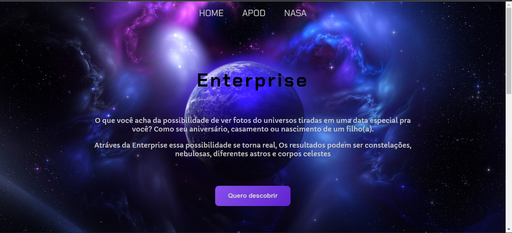

# APOD-NASA-API 

<h1>Projeto proposto pela Resilia Educação na terceira semana do módulo 2 💛🖤</h1> 

-  <a href="#sobre">Sobre</a> 
-  <a href="#requisitos">Requisitos</a>  
-  <a href="#layout">Layout</a>  
-  <a href="#teste-aqui">Teste aqui</a> 
-  <a href="#tecnologias">Tecnologias</a>

# SOBRE

A nasa oferece uma série de API's que fornece acesso aos seus projetos e sistemas a <strong> "Astronomy  Picture Of The Day" </strong> (APOD) é uma API que fornece uma foto ou video diariamente para que as pessoas consigam descobrir um pouco mais sobre o espaço 

# REQUISITOS

 - [X] Sua aplicação deve ser capaz de receber uma data como entrada do usuário a partir de um formulário
 - [X] Com a data selecionada, ao clicar no botão de envio, uma requisição deve ser enviada a [API DA APOD](https://api.nasa.gov/) para que seja obtida a foto ou video referente ao dia escolhido
 - [X] De posse dessa informação, a página deve ser manipulada para que os dados retornados sejam devidamente exibidos
 - [X] Sua aplicação deve, obrigatoriamente, ter um repositorio no Github, estar disponivel em uma Githu pages e utilizar jQuery

  
# LAYOUT

# Teste aqui 

 https://shiellynferr.github.io/APOD-NASA-API/
 #  Tecnologias

As seguintes tecnologias foram utilizadas nesse projeto

- [Html](https://developer.mozilla.org/pt-BR/docs/Web/HTML)
- [Css](https://developer.mozilla.org/pt-BR/docs/Web/CSS)
- [Javascript](https://developer.mozilla.org/pt-BR/docs/Web/JavaScript/Guide/Introduction)
- [Jquery](https://jquery.com/)

  
 > Made with 💙 by Shiellyn Ferreira [See my Linkedin](https://www.linkedin.com/in/shiellyn-ferreira/)
